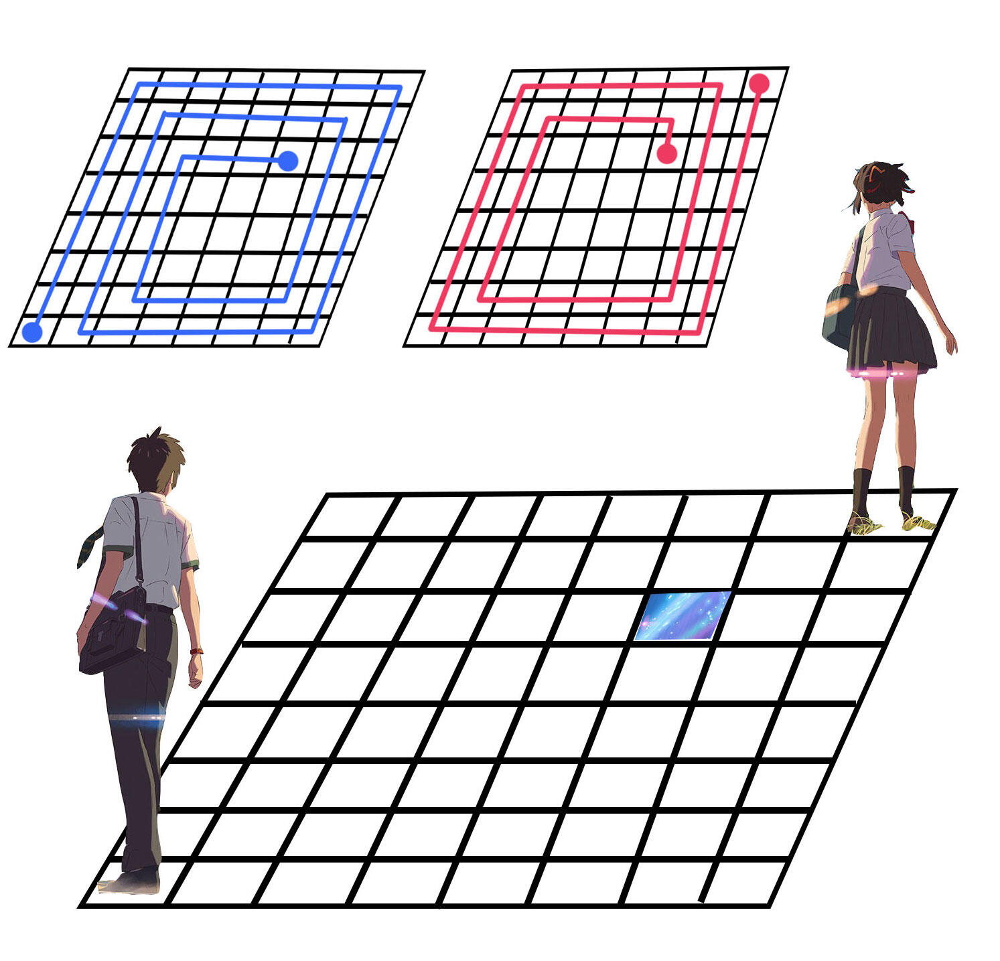

### Background

The protagonist of this problem is not the TA, but Taki and Sanya, which the TA likes very much.

### Description

In a map of `n*n` squares, Taki and Sanya are located at the two coordinates: `(n, 1)` and` (1, n)`, respectively. They would like to meet at `(i, j)`.

`(i,j)` denotes the square at the `i`th row (counted from top to bottom) and the `j`th column (counted from left to right).

Their respective paths along the grid are spirals that rotate clockwise.

### Input Form

Three integers `n, i, j` in one line, which represent the size and the coordinate of the meeting square, respectively.

### Output Form

The number of steps Taki and Sanya take to meet, separated by white space.

### Examples

Input：`3 2 3` 

The desired output： `5 1`

Input：`8 3 6` 

The desired output： `54 48`

### Input Range

`1≤n≤1000000`