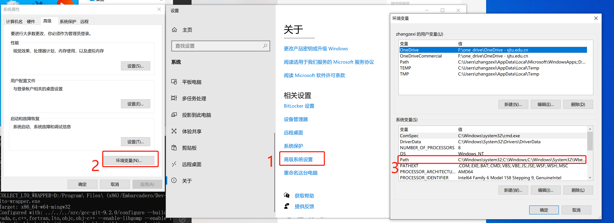
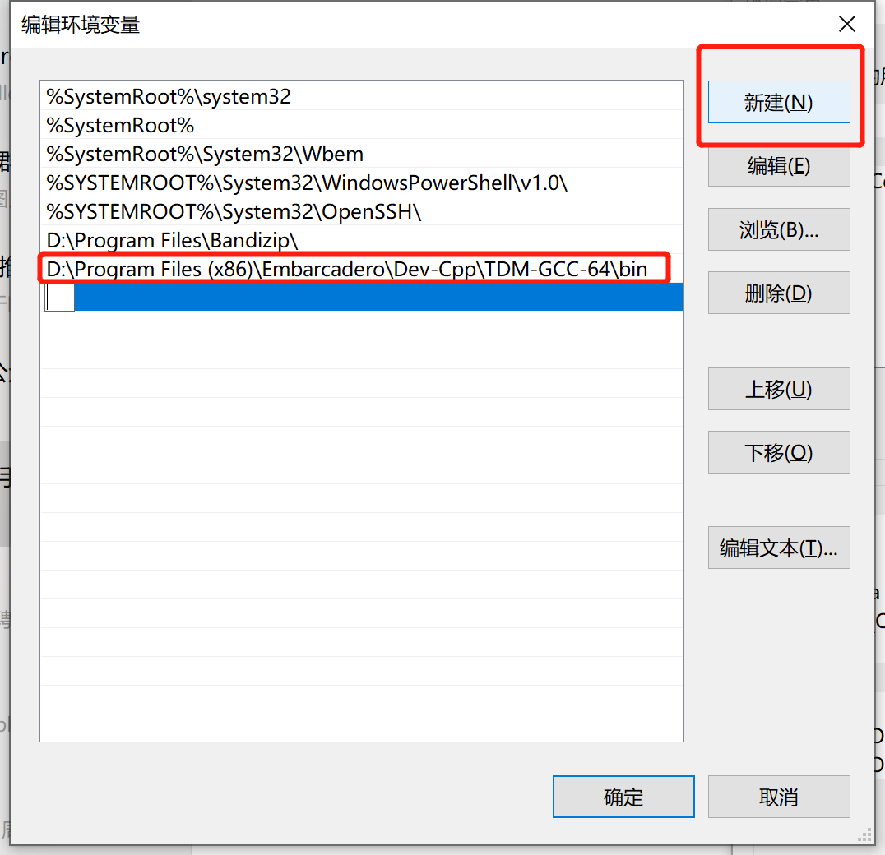
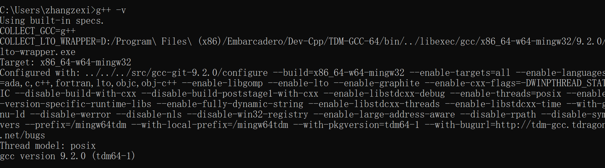
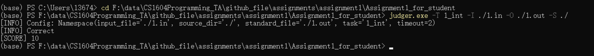

### Assignment 1

本次实验主要练习C++基础语法。

本次实验共分为8题。

#### 对应知识点

第零题：C++基本表达式

第一题：整数类型数据范围

第二题：循环结构

第三题：分支结构

第四题：综合运用

第五题：综合运用

第六题：综合运用

第七题：综合运用

#### 要求

输入输出严格按照题目表述中的格式，不要输出额外的信息。

参考`codeing style.pdf`文件，规范编程。另外在程序中写上必要的注释。coding style会占一小部分的分数。

#### 自测

我们每道题目都给出了一些测试点便于同学自测。同学可以自行使用任意文本编辑器打开.in和对应的.out文件查看。

另外，为了避免同学与助教的测试环境不同造成的问题，请同学提交作业前使用`judger.exe`进行测试。

##### 配置g++到环境变量。

要运行`judger.exe`，需要配置g++到环境变量。

可以先打开Windows powershell或cmd，输入 `g++ -v` 命令，如果提示”不是内部或外部命令也不是可运行的程序“，则说明`g++`未被添加到环境变量中。

添加`g++`到环境变量方法：

①找到`g++.exe`的安装位置(与安装codeblocks时的设置有关）。

②打开环境变量设置。



③将第①步中的`g++.exe`所在文件夹目录（通常是`bin`文件夹）增加到Path中，如下图所示。



④配置完成后，打开一个**新的**powershell或cmd窗口，运行 `g++ -v` ，如果出现可以显示g++的版本信息则配置完成。



##### `judger.exe`的使用方法

见下图：



其中`-T`对应题目名称，`-I`为用例输入，`-O`为用例输出，`-S`为源码所在文件夹，源码命名按照提交要求中来。

如果`judger.exe`使用有问题可以使用`judger.exe -h`命令查看或询问助教。

**注意**：

1. 写程序和调程序时可以先忽略`judger.exe`。前期题目很简单，几乎不会出现环境上的问题，所以**请同学们把主要精力放到做题上**，可以直接手动在`console`中输入来测试程序。
2. **最终测试及评分结果以`judger.exe`为准**，大部分情况下，第1步完成的程序都会过`judger.exe`的测试。如果出现问题且无法自己解决，请询问助教和老师。
3. 推荐大家使用Windows系统和老师指定的编辑器、编译器。`judger.exe`无法在Linux或Macos系统上运行，非Windows系统的同学建议安装虚拟机。

#### 提交

所有需要提交的文件为：

```
0_get_digit.cpp
1_int.cpp
2_palindrome_number.cpp
3_password.cpp
4_length.cpp
5_len_of_path.cpp
6_calendar.cpp
7_fast_exponentiation.cpp
```

上述文件放到以**学号命名**的文件夹中并压缩为zip提交。务必按照规范提交，否则自动化测试无法测出你的分数！！！