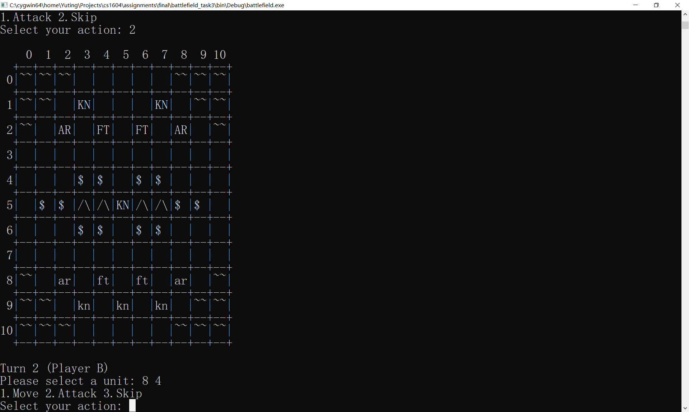
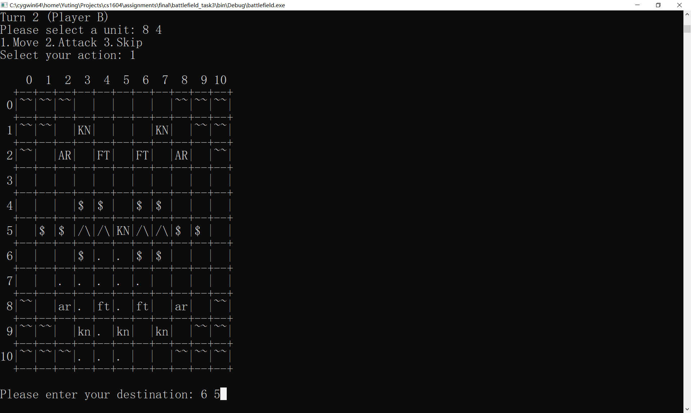
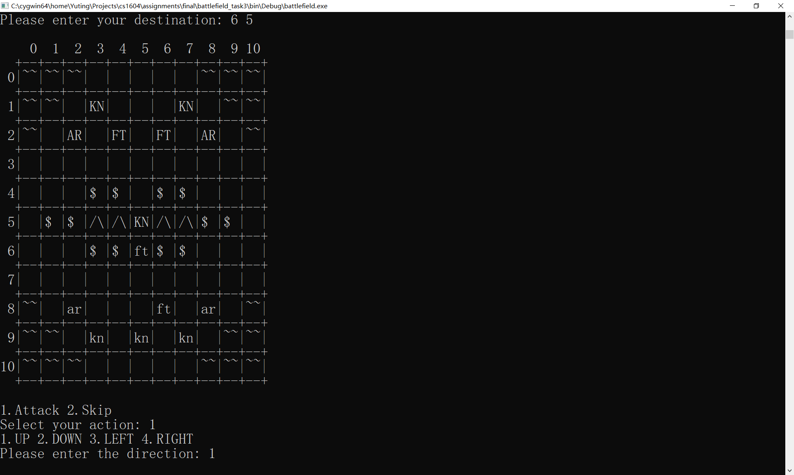
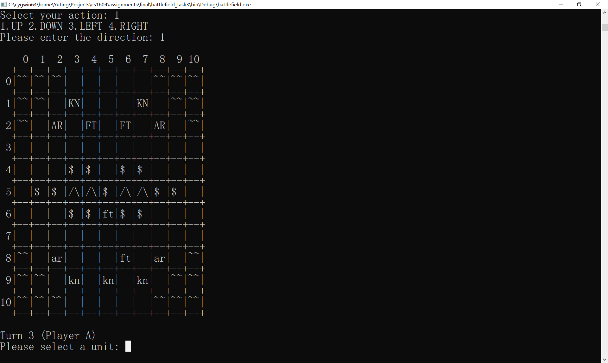
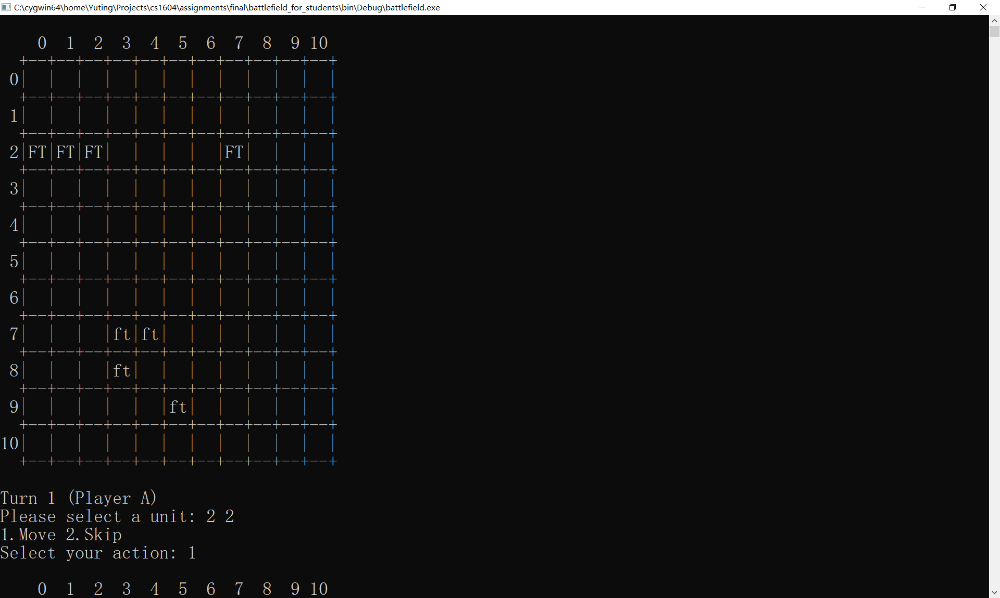
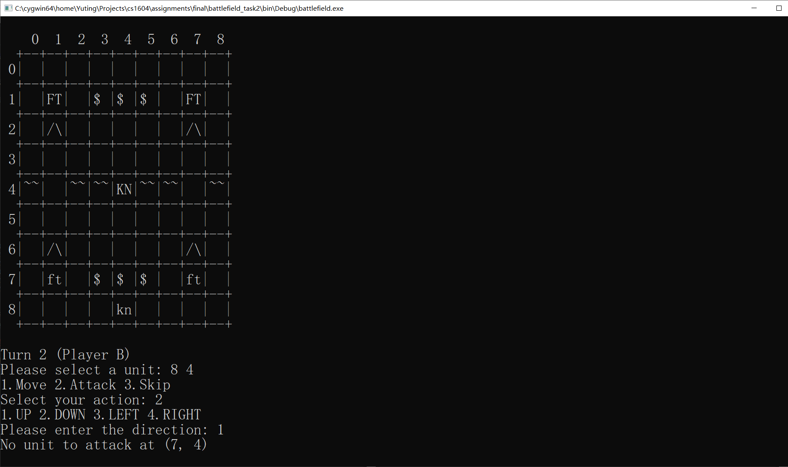
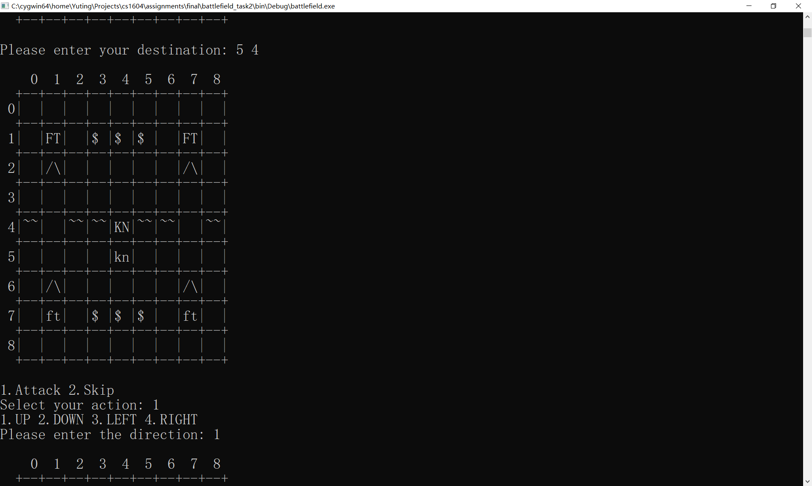

# Battlefield
## 基本介绍
`Battlefield`是一个回合制战棋类游戏。在`M x N`的战场(`Field`)上（`M`为战场高度，`N`为战场宽度），`Player A`和`Player B`交替操作自己控制的单位(`Unit`)移动和攻击对方单位，如果一方的单位全部被消灭，那么对方将获胜。下图显示了一个`11 x 11`的战场，其中大写字母代表的是`Player A`的单位，小写字母代表`Player B`的单位，`/\`、`~~`、`$ `等格子代表特殊地形（详见之后介绍）。这些图片显示了前两回合的游戏进程：第一回合，`Player A`将坐标`(1,5)`的骑士单位(`Knight`，简写为`KN`)移动到坐标`(5,5)`;第二回合，`Player B`将坐标`(8,4)`的步兵单位(`Footman`，简写为`FT`)移动到`(6,5)`，并攻击`(5,5)`的骑士将其消灭。游戏将由两位玩家交替进行下去，直至一方胜利。







## 你的任务（20分）
该游戏由C++编写，其基本框架已经搭建完毕并提供给你，但是还有许多关键的功能没有实现，你需要实现这些功能，并通过所有的测试案例。注意，通过所有测试案例可以拿到全部的基础总分（共30分），但**最终的大作业成绩还取决于能否通过隐藏测试案例**，为了保证你能通过隐藏测试案例，你需要使用我们提供的参考程序(demo)，对标**自行测试各种边缘情况**，你的测试考虑周到与否将决定你是否能通过隐藏测试案例。

我们提供的文件结构如下：
```
judger_student
|- readme         // 本说明文档
|- battelfield    // 提供的程序框架
|- judger.py      // 测试用Python脚本
|- source         // 各个任务源程序的位置
|- data           // 各个任务测试用数据
|- maps           // 自行测试用地图
|- demo           // 参考程序
```


### 热身(0分)：阅读并理解程序结构
你首先需要对该项目的结构有基本的了解。游戏项目的源程序结构如下：
```
battlefield
|- main.cpp         // 程序入口
|- units.h          // 单位类头文件（访问单位的接口）
|- units.cpp        // 单位类的实现）
|- field.h          // 战场类头文件（访问战场的接口）
|- field.cpp        // 战场类实现
|- algorithms.h     // 寻路算法头文件
|- algorithms.cpp   // 寻路算法实现
|- actions.h        // 单位行动的接口（移动，攻击等）
|- actions.cpp      // 单位行动的实现
|- engine.h         // 游戏引擎接口
|- engine.cpp       // 游戏引擎的实现（包括和用户交互）
```

其主要分为以下几个部分：

1. 单位类的接口和实现 (`units.h`和`units.cpp`)。定义了名为`Unit`的类代表出场单位，关键属性包括单位类型`UnitType`，单位所属的玩家`side`（其中`side = true`时单位属于`Player A`，否则属于`Player B`），以及单位在战场上的坐标（`urow`代表行，`ucol`代表列）。
2. 战场类的接口和实现 (`field.h`和`field.cpp`)。定义了名为`Field`的类代表战场，其有一个包含`Unit`指针的`Grid`容器`units`表示战场。如果`units[i][j]==NULL`，则说明坐标`(i,j)`没有单位存在，否则`units[i][j]`包含指向坐标`(i,j)`单位的指针。该类的关键成员函数包括：`getUnit`返回给定坐标的单位，`setUnit`设置某个坐标的单位，`moveUnit`将某个坐标的单位移动到另一个坐标，`display`打印当前地图到给定输出流（其中第二个可选参数指定哪些格子需要被打印为`. `以显示单位可移动范围）。
3. 寻路算法的接口和实现 (`algorithms.h`和`algorithms.cpp`)。定义了确定单位移动范围的寻路算法，**本项目不需要你理解寻路算法是如何实现的，只需理解如何使用该算法**。详见接下来的任务描述。
4. 单位行动的接口和实现 (`actions.h`和`actions.cpp`)。定义了单位行动对其他单位和战场的效果。包括定义了单位可以进行的动作(`Action`枚举类)，以及单位动作的实现函数(`selectUnit`选择单位，`moveUnit`移动单位等)。*注意该部分代码不直接涉及和用户的交互，所有的用户交互应该在游戏引擎中实现。*
5. 游戏引擎 (`engine.h`和`engine.cpp`)。定义了回合制游戏进行的主要循环过程，给定一个初始战场`field`，调用`play`函数开始游戏。具体实现中还包括如何和用户进行交互，推动游戏进行。其他的接口函数均为测试用函数，其中`displayField`显示当前战场，`addFootman`添加一个步兵单位到指定坐标。
6. 程序入口(`main.cpp`)。定义了一个初始战场，设定初始单位，并调用`play`函数开始游戏。

你需要在总体上掌握上述代码结构，为下面的任务打下基础。


### 任务1(8分)：单位移动、特殊地形、新类型单位，以及装载地图

该部分任务分为如下几个部分，你需要完成它们并通过所有测试。为了保证你能通过隐藏测试案例，你需要使用我们提供的参考程序自行测试边缘情况，任务一的参考程序在`task1_complete`文件夹下面。


#### 1.1. 实现单位移动

在提供给你的代码中，单位移动功能由`engine.cpp`中的`performMove`发起。首先，该函数需要调用searchReachable寻路算法检查可以到达的范围。代码如下：
```
Grid<bool> grd =
  searchReachable(getFieldCosts(field), u->getRow(), u->getCol(), u->getMovPoints());
```
`searchReachable`的第1个参数是战场上每个格子需要消耗的移动点数。给定一个`M x N`的战场，`getFieldCosts(field)`返回`M x N`的整数`Grid`代表战场格子的移动点数消耗。第2和3个参数表示单位的坐标，最后一个参数代表单位可用的移动点数。我们假设`Footman`的移动力为3。`searchReachable`返回一个`M x N`的布尔值`Grid` `grd`。`grd[i][j] == true`当且仅当该单位的移动力能到达坐标`(i,j)`。 经过和用户交互后，`performMove`调用`actions.cpp`中的`moveUnit`函数实现移动，后者进一步调用`Field::moveUnit`成员函数实现移动。

当前move功能存在各种缺陷，导致游戏崩溃。例如，移动`(2,2)`处单位至`(3,4)`导致`Assertion Failure`。




**你需要修改上述函数，使得移动命令能够正常工作**。需要注意如下事项
* 一个格子如果已经有单位存在，那么无法移动到这个格子上。你可以假设这种格子将消耗巨量的移动力（如999点移动力）
* 在实现移动命令时，你需要考虑目的地坐标是否超出移动范围，是否有各种越界等等。


#### 1.2. 实现特殊地形

在初始程序中，我们假设所有的地形都是平原(Plain)，每个平原格子消耗1点移动力（体现在`getFieldCosts`函数中将所有格子移动消耗都设置为1）。**你需要实现一些特殊地形**，并且将它们在地图上正确的显示出来（所有地形都显示为长度为2的字符串，如平原地形为2个空格）。这些新地形包括

* 高山(Mountain)。高山地形是不可穿越的，其移动力消耗为999，在地图上显示为`/\`
* 深水(Water)。深水地形也是不可穿越的，其移动力消耗为999，在地图上显示为`~~`
* 森林(Forest)。森林地形移动力消耗为2，在地图上显示为`$ `

实现地形需要修改`getFieldCosts`得到正确的移动力消耗值，使得寻路算法能够正常工作。例如在下图中，`(8,4)`的步兵移动力为3，因此可以通过`(7,4)`踏上`(6,4)`的森林（正好消耗3移动力）。但是他无法踏上`(6,3)`的森林（移动力不够）。


注意在修改显示地图的函数时，如果一个特殊地形上有一个单位，应该优先显示该单位。此外，在显示移动范围时，移动范围代表的`. `符号应该覆盖特殊地形。


#### 1.3. 设计新单位

一开始我们只有一个单位类型步兵(`Footman`)。**你需要添加一个新单位类型骑士**(`Knight`)，该类型的唯二不同之处在于：
* 骑士的移动力为5(比步兵多2点)
* 骑士在战场上显示为`KN`（或者`kn`）

为此，你需要修改`units.h`和`units.cpp`。


#### 1.4. 装载地图

在初始程序中，我们在`main`函数中定义了一个固定的地图。**你需要实现一个函数`loadMap`，从输入流中装载一个新的战场地图。**该函数应该定义在`engine.cpp`中，其原型如下：
```
#include <iostream>
#include "field.h"

// Load map
Field* loadMap(std::istream& is);
```
给定一个提供地图信息的输入流`is`，该函数分配（使用`new operator`)并返回一个对应的`Field`对象。 其中，`is`可以绑定在`cin`上，也可以绑定在文件输入流上。该输入流提供的地图信息格式如下：
* 第一行`M N NT NU`:代表当前战场大小为`M x N`，一共有`NT`个特殊地形（除平原），`NU`个单位
* 接下来`NT`行特殊地形信息，每行格式为`R C T`，代表在`(R,C)`坐标有一个地形为`T`。`T = W`代表深水，`T = M`代表高山，`T = F`代表森林
* 接下来`NU`行代表单位信息，每行格式为`R C S U`，代表在`(R,C)`坐标有一个类型为`U`的单位。其中`U = FT`代表步兵，`U = KN`代表骑士。`S = A`代表该单位为 `Player A`的单位，`S = B`代表该单位为 `Player B`的单位。

例如，下列输入描述了一个`9 x 9`的地图：
```
9 9 16 6
4 0 W
4 2 W
4 3 W
4 5 W
4 6 W
4 8 W
2 1 M
2 7 M
6 1 M
6 7 M
7 3 F
7 4 F
7 5 F
1 3 F
1 4 F
1 5 F
0 4 A KN
1 1 A FT
1 7 A FT
8 4 B KN
7 1 B FT
7 7 B FT
```

其地图显示为：


### 任务2(8分)：攻击和游戏终止

该部分任务分为如下几个部分，你需要完成它们并通过所有测试。为了保证你能通过隐藏测试案例，你需要使用我们提供的参考程序自行测试边缘情况，任务一的参考程序在`task2_complete`文件夹下面。

#### 2.1 实现攻击命令
我们将给每个单位实现一个攻击命令。如下图所示，`Player B`选择`(8,4)`的骑士时将显示一个`Attack`指令，选择该指令将提示你选择攻击方向。*一个单位可以攻击上下左右相邻的格子*。如果攻击范围内没有单位，那么将显示`No unit to attack ...`。



除了原地攻击，一个单位还可以*移动后攻击*。如下图中，`Player B`首先将`(8,4)`的骑士移动至`(5,4)`，然后选择`Attack`指令，选择向上攻击，消灭了位于`(4,4)`的骑士。





**你的任务是实现上述原地攻击和移动后攻击命令**。最终程序的行为必须和参考程序的行为一致。需要注意以下几点：
* 移动之后不允许再次移动或者选择其他单位，只能使用当前单位攻击或者跳过当前回合(Skip)
* 记得检查各种边缘和越界情况，确保游戏不存在BUG或者崩溃。

#### 2.2 游戏终止

当一方消灭所有对方单位时，这方将获胜，游戏终止。**你需要实现游戏终止的检查**，并输出“Congratulations! Player A/B has won!"，如下图所示：


### 任务3(4分)：远程单位和射击命令

现有的单位都是近战单位，我们要实现第一个远程单位：弓箭手(Archer)。弓箭手和步兵骑兵不同在于他/她只能射击(Shoot)上下左右相邻2格的单位（而Attack只能攻击相邻1格的单位）。下图中位于坐标`(2,2)`的弓箭手（表示为`AR`）射击了位于`(2,4)`的步兵，将其击杀（记住我们所有的攻击都不做敌我判定，因此可以伤害友军;)）。和近战攻击一样，允许移动后射击。


你的任务包括：
* 设计一个ARCHER类型的单位，该单位的移动力为3，显示为`AR`或`ar`
* 修改相应的文件，以支持Shoot命令，注意只有Archer能Shoot，其他单位只能Attack
* 注意检查各种边缘情况。

## 调试游戏

为调试游戏，你首先需要准备好一个地图，使用`loadMap`装载生成一个战场，然后在标准输入端输入命令，观察输出端的结果。主函数的示例结构如下：

```
int main()
{
    string filename = "map.txt";
    ifstream ifs;
    ifs.open(filename.c_str());
    if (!ifs) {
        cout << "Cannot open the file: " << filename << endl;
        return -1;
    }

    Field* f = loadMap(ifs);
    if (f == NULL) {
        cout << "Failed to load map!" << endl;
        return -1;
    }
    play(*f, cin, cout);

    delete f;
    ifs.close();
    return 0;
}
```

初始代码中以及准备好了2张测试地图`map1.txt`和`map2.txt`。你也可以设计自己的地图用于调试。

## 测试游戏

我们使用`judger.py`脚本做最终的测试，为此你需要将主函数改为**从`cin`中读取地图及之后的用户命令**，然后将结果输出到`cout`。每个任务我们准备了5个测试案例，放在`data`文件夹中。**你的程序必须通过所有测试案例才能拿到对应任务的满分**。每完成一个任务，你需要将`battelfield`目录下的代码拷贝到`source`目录下对应的任务文件夹中。特别注意本次作业使用`StanfordCppLib`，因此需要将编译StanfordCppLib产生的cs1604文件夹的**绝对路径**复制到`source/cs1604.txt`下，以让`judger`成功编译你的程序。
```
source
|- 1_task1
|  |- main.cpp
|  ...
|
|- 2_task2
|  |- main.cpp
|  ...
|
|- 3_task3
|  |- main.cpp
|  ...
|
|- cs1604.txt (include the StanfordCppLib) 
```

然后在Windows命令行中运行
```
python judger.py -1  // 1 代表第1个任务，同理可测试2、3任务
```
如果测试通过，输出结果
```
[T1 c1] Correct
[T1 c2] Correct
...
```
如果测试不通过，则会显示输出不对应的地方。为了测试所有的结果，可以直接调用
```
python judger.py
```


## 隐藏测试（10分）
本次大作业有一部分隐藏测试用来测试**所有任务都完成的程序**各种可能出现的极端情况，**通过所有隐藏测试才可以得到满分**。该隐藏测试将不会透露给学生，所以请特别注意自行测试各类边缘情况。自行测试的结果可以和参考程序相对比，参考程序在`demo`文件夹下面。有2个版本：

* `demo1.exe`从`map.txt`中读取地图文件，然后和用户通过标准输入输出进行交互。
* `demo2.exe`从`in.txt`中读取地图文件和所有用户输入，将结果输出到`out.txt`。

前者用来做交互测试，后者用来做文件输入输出的对比测试。

## 提交文件格式
你需要提交的文件结构应该类似如下形式：

```
<your student number>.zip
|- 1_task1
|  |- main.cpp
|  ...
|
|- 2_task2
|  |- main.cpp
|  ...
|
|- 3_task3
|  |- main.cpp
|  ...
|
|- cs1604.txt (include the StanfordCppLib) 
```
