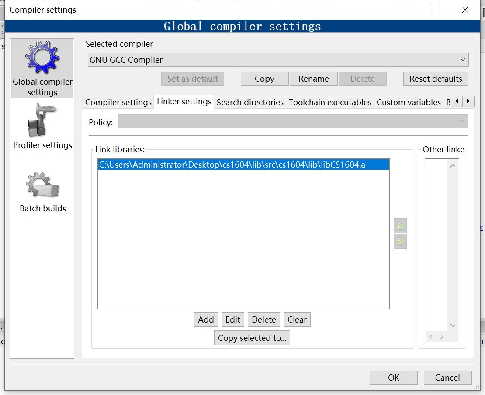

## 如何使用StanfordCppLib

[toc]

​		目前为止，我们所学的程序用的库都是C++的标准库，在程序中通过`#include<xxx>`引用这些库。只要你的计算机上有c++的编译器，就可以引用这些库。但是c++的标准库功能繁多，接口复杂，用起来并不那么方便，而且我们的作业并不需要用到那么多的功能。所以我们在后续的课程中将会使用**Stanford C++ libraries(StanfordCppLib)**，它基本上提供了足够我们课程使用的ADT，而且它将c++标准库的接口做了简化，方便大家使用。

​		StanfordCppLib并不是一个标准库，所以并不能像标准库那样用`#include<xxx>`来引用，它与大家自己实现的库一样，需要提供源代码，通过编译，并在自己的源程序里通过`#include"xxx.h"`来引用它的接口。我们在这里提供了StanfordCppLib的部分源代码，大家跟着这个配置教程，编译StanfordCppLib并加入到CodeBlocks编译环境，后面就可以直接引用这些库了。

​		StanfordCppLib也有自己的接口文档，大家要想知道某个库有什么接口，实现了什么功能，应该去参考[StanfordCppLib](https://cs.stanford.edu/people/eroberts/StanfordCPPLib/doc/index.html)。注意在这个主页上，大家只需要关注**Collection classes**的部分，也就是说我们后面使用的库基本属于StanfordCppLib的Collection部分，比如`Vector, Map, Set, Queue, Stack`。

> 如果大家想要知道`Stack`的接口和使用方法，在[StanfordCppLib](https://cs.stanford.edu/people/eroberts/StanfordCPPLib/doc/index.html)中点击[Stack\<ValueType\>](https://cs.stanford.edu/people/eroberts/StanfordCPPLib/doc/Stack-class.html)进入关于Stack这个ADT的文档

### 编译`StanfordCppLib`
​		如果大家点击进入`src`文件夹查看StanfordCppLib的源代码就会发现，它其实和大家实现的库文件没有什么区别。所以我们可以每次想用这个库时就把整个`src`加入到自己的工程项目中，但是这样每开一个新工程就要重新将这个库引入并编译，比较繁琐。

​		我们其实可以把`StanfordCppLib`当成一个静态库，将它加入到CodeBlocks的编译环境，后面我们直接引用这些库时，CodeBlocks会帮我们把`StanfordCppLib`自动链接进来，达到了一劳永逸的效果。

配置步骤：

1. 确保的你的C++编译器`g++`在环境变量中，并且要保证你命令行中的`g++`编译器与CodeBlocks使用的`g++`编译器相同。cmd中输入`where.exe g++`，应该输出类似`xxx\CodeBlocks\MinGW\bin\g++.exe`的结果。如果与预期结果不同，建议大家重新按照第一次作业的方式配置`g++`
   
   另外如果你之前安装过`g++`，那么还要确保你的CodeBlocks使用的是自带的`g++`而不是之前安装的`g++`。在CodeBlocks中通过`Settings > Compiler > ToolChain executables`检查编译器路径是不是CodeBlocks的MinGW，如果不是，请根据自己的CodeBlocks路径进行相应修改

   

2. 在课程页面上下载本课程用的`StanfordCppLib`

3. 解压文件，打开终端并cd到`src`

4. 这个库的编译命令根据所在系统的不同分别在`Makefile.windows`和`Makefile.linux`下。一般来说，如果你在windows下开发，你只需在命令行敲入如下命令即可编译整个`StanfordCppLib`

    `mingw32-make -f Makefile.windows`
    
    因为可能出现各种问题导致你需要重新去编译这个库，那么在编译前你需要先把之前编译产生的文件清除，通过如下命令

    `mingw32-make -f Makefile.windows clean`

    > 如果你是在Linux/MacOS下开发，你应该用如下命令来编译和清除`StanfordCppLib`
    >
    > `make -f Makefile.linux`
    > 
    > `make -f Makefile.linux clean`
    > 
    > 当然你得确保`make`已经安装在你的系统上

5. 如果编译成功，你会发现一个新的文件夹`src/cs1604`，里面就算编译好的库文件

### 在CodeBlocks中使用`StanfordCppLib`
1. `cs1604`中包含了两个文件夹，`include`里面是所有你可以引用的头文件，`lib`里面是编译好的库的实现，在这里为`libCS1604.a`

2. 打开CodeBlocks，前往`Settings > Compiler > Linker settings`，点击`Add`并把编译好的库文件也就是`.a`文件加入到路径中

    

3. 前往`Settings > Compiler > Search Directories`，点击`Add`将头文件的文件夹加入到路径中

    

4. 配置完成后，新建工程文件测试`test`文件夹中的`main.cpp`程序，编译通过并全部输出`PASS`后即证明`StanfordCppLib`配置完成。

### 在终端使用`StanfordCppLib`

如果你不用CodeBlocks来开发，下面提供一些命令让你可以在命令行编译你引用了`StanfordCppLib`的程序

```bash
# Windows
g++ -I ../src/cs1604/include/ -L ../src/cs1604/lib/ main.cpp -l CS1604 -o main.exe
# linux/MacOS
g++ -I ../src/cs1604/include/ -L ../src/cs1604/lib/ main.cpp -l CS1604 -o main
```

其中`-I`后面跟着库的头文件，`-L`后面跟着编译好的库文件即`libCS1604.a`文件所在的文件夹路径，`-l`跟着库的名字，这里是`CS1604`。